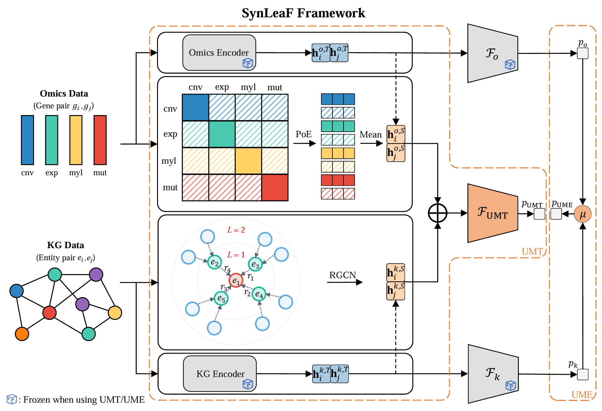

# SynLeaF: A Dual-Stage Multimodal Fusion Framework for Synthetic Lethality Prediction Across Pan- and Single-Cancer Contexts


*Figure 1: Overview of the proposed framework.*

## Abstract

Synthetic lethality (SL) prediction faces significant challenges in the effective fusion of heterogeneous multi-source data.
Existing multimodal methods often suffer from "modality laziness" due to disparate convergence speeds, 
which hinders the exploitation of complementary information. 
In this study, we propose SynLeaF, a dual-stage multimodal fusion framework for SL prediction across pan- and single-cancer contexts. 
The framework employs a VAE-based cross-encoder with a Product of Experts mechanism to fuse four omics data types 
(gene expression, mutation, methylation, and CNV), 
while simultaneously utilizing a relational graph convolutional network to capture structured gene representations from biomedical knowledge graphs. 
To mitigate modality laziness, we introduce a dual-stage training mechanism employing feature-level knowledge distillation 
with adaptive Uni-modal Teacher and Ensemble strategies. 
In extensive experiments across eight specific cancer types and a pan-cancer dataset, 
SynLeaF achieved superior performance in 17 out of 19 scenarios.
Ablation studies and gradient analyses further validate the critical contributions 
of the proposed fusion and distillation mechanisms to model robustness and generalization.

## Installation

This project must be run in a Conda environment.

### 1. Create Environment

```bash
conda create -n SynLeaF python=3.11
conda activate SynLeaF
```

### 2. Install PyTorch

Please install PyTorch matching your CUDA version.

```bash
pip install torch==2.4.0 torchvision==0.19.0 torchaudio==2.4.0 --index-url https://download.pytorch.org/whl/cu124
```

### 3. Install Other Dependencies

After installing PyTorch, run the following command to install the remaining dependencies:

```bash
pip install accelerate==0.34.2 pandas matplotlib tqdm scikit-learn biopython torch_geometric
```

## Data Preparation

The recommended data directory structure is as follows:

```text
SynLeaF/
├── data/
├── data_raw/
│   ├── ELISL/         # train_pairs.csv, test_pairs.csv
│   ├── SLKG2/         # Human_SL.csv, ...., sldb_complete.csv
│   ├── TCGA/          # Cancer omics data (BRCA, CESC, etc.)
│   │   ├── BRCA/
│   │   │   ├── cna.txt
│   │   │   ├── exp.txt
│   │   │   ├── mut.txt
│   │   │   └── myl.txt
│   │   └── ...
│   └── uniprot/       # uniprotkb_..._.fasta
├── result/
├── src/
└── ...
```

### TL;DR
If you prefer not to download and organize data manually, you can download the packaged raw data [`data_raw.tar.gz`](https://drive.google.com/file/d/1IFvkEcOWdfmlkg60hB5hZr3VXT5EQJrB/view?usp=sharing) from the cloud storage and extract it to the project root directory.

### Detailed Download Guide

<details>
<summary>🔻 Click to expand detailed data download and renaming steps</summary>

#### 1. SL Label Data
Download the following files from [ELISL supplement files](https://figshare.com/articles/dataset/ELISL_Datasets/23607558) and place them in `/data_raw/ELISL`:
- [train_pairs.csv](https://figshare.com/ndownloader/files/41411913)
- [test_pairs.csv](https://figshare.com/ndownloader/files/41411895)

#### 2. Protein Sequence
Download Human Reviewed sequences from [UniProt](https://www.uniprot.org/uniprotkb?query=organism_id%3A9606&facets=reviewed%3Atrue).
- Click Download and select **FASTA (canonical)** as the format.
- Rename the file to `uniprotkb_organism_id_9606_AND_reviewed_2024_10_26.fasta`.
- Place it in `/data_raw/uniprot`.

*(Note: Test data was downloaded on 2024-10-26, containing 20,428 sequences)*

#### 3. Knowledge Graph
Download the following files from [SynLethDB 2.0](https://synlethdb.sist.shanghaitech.edu.cn/v2/#/download) and place them in `/data_raw/SLKG2`:

- [Human_SL](https://synlethdb.sist.shanghaitech.edu.cn/v2/static/download/SL/Human_SL.csv)
- [Human_nonSL](https://synlethdb.sist.shanghaitech.edu.cn/v2/static/download/nonSL/Human_nonSL.csv)
- [Human_SR](https://synlethdb.sist.shanghaitech.edu.cn/v2/static/download/nonSL/Human_SR.csv)
- [sldb_complete.csv](https://synlethdb.sist.shanghaitech.edu.cn/v2/static/download/complete/sldb_complete.csv)

#### 4. Cancer Omics Data
Taking **BRCA (Breast Cancer)** as an example:
1. Visit [cBioPortal (BRCA)](https://www.cbioportal.org/study/summary?id=brca_tcga) and click Download.
2. After extraction, retrieve the following files, rename them, and place them in `/data_raw/TCGA/BRCA`:
    - `data_mrna_seq_v2_rsem_zscores_ref_all_samples.txt` -> **exp.txt**
    - `data_mutations.txt` -> **mut.txt**
    - `data_methylation_hm450.txt` -> **myl.txt** (Note: Select the hm27 version for OV cancer)
    - `data_linear_cna.txt` -> **cna.txt**

Please repeat the above steps for the following cancers:
[CESC](https://www.cbioportal.org/study/summary?id=cesc_tcga), 
[COAD](https://www.cbioportal.org/study/summary?id=coadread_tcga), 
[KIRC](https://www.cbioportal.org/study/summary?id=kirc_tcga),
[LAML](https://www.cbioportal.org/study/summary?id=laml_tcga),
[LUAD](https://www.cbioportal.org/study/summary?id=luad_tcga),
[OV](https://www.cbioportal.org/study/summary?id=ov_tcga),
[SKCM](https://www.cbioportal.org/study/summary?id=skcm_tcga).

#### 5. Pan-Cancer Data
Visit [PanCan 2020](https://www.cbioportal.org/study/summary?id=pancan_pcawg_2020), download and process:
- `data_cna.txt` -> **cna.txt**
- `data_mutations.txt` -> **mut.txt** (Remove the first two comment lines starting with `#`)
- `data_mrna_seq_fpkm_zscores_ref_all_samples.txt` -> **exp.txt**

*(Note: Pan-cancer data does not contain Methylation)*

</details>

## Data Preprocessing

> [!IMPORTANT]
> All Python scripts must be run within the `src` directory. Please execute `cd src` first.

### TL;DR
If you prefer not to preprocess data manually, you can download the packaged processed data [`data.tar.gz`](https://drive.google.com/file/d/1TV3Rxdr3q-ZjliAsouDTMpHGI30yaHUr/view?usp=sharing) from the cloud storage and extract it to the project root directory.

### Step 1: Base Data Generation
Run the following command, which will generate some necessary data and the raw SL samples for 8 types of cancers from ELISL.
```bash
python preprocess_pre.py
```
*If you need to train on other cancers, please manually add data to `data_raw/SL/ANOTHER_CANCER.csv` (refer to the other cancer dataset for format).*

### Step 2: Generate Training Data
Generate training status data for specific cancers.

**Specific Cancers:**
```bash
python preprocess_main.py \
    --ct BRCA CESC COAD KIRC LAML LUAD OV SKCM \
    --cn_kg "breast cancer" "cervical cancer" "colon cancer" "kidney cancer" "hematologic cancer" "lung cancer" "ovarian cancer" "skin cancer"
```

``--cn_kg`` is the list of entity names of `Disease` in SLKG 2.0, corresponding to a list of cancers (`--ct`).

All supported values in ``cn_kg`` are provided in the `misc/supported_cn_kg.txt` folder. If there is no cancer you want, use `EMPTY` instead. 

**Pan-Cancer:**
```bash
python preprocess_main.py \
    --ct pan \
    --cn_kg TOTAL \
    --omics_types cna exp mut
```

*(Note: To ensure consistency in experimental results, it is recommended to copy and run the above commands directly)*

### Step 3: K-Fold Cross-Validation Split
Generate 5-Fold split data for Pan-cancer and 8 specific cancers at once.
```bash
python preprocess_folder.py \
    --ct BRCA CESC COAD KIRC LAML LUAD OV SKCM pan
```

## Training & Evaluation

### 1. Accelerate Configuration
Please modify `accelerate_config.yaml` according to your hardware.
*   Recommended configuration: **2 GPUs** (to match our experimental environment).

### 2. Single Fold Training
Modify parameters in `train.py` and run:
```bash
accelerate launch --config_file ../accelerate_config.yaml train.py
```

### 3. Parallel Training
Use `scheduler.py` for multi-card parallel scheduling. Please configure the ``single_card_memory`` and ``card_groups`` parameters according to your specific hardware environment.

**Execution Flow:**

1.  **Stage 1: Single-modal Pre-training**
    ```bash
    nohup python -u scheduler.py \
        --task_types only_omics only_kg \
        > scheduler_1.log 2>&1 &
    ```

2.  **Stage 2: Multimodal Joint Training**
    ```bash
    nohup python -u scheduler.py \
        --task_types umt ume \
        > scheduler_2.log 2>&1 &
    ```

3.  **Result Statistics**
    ```bash
    python analysis.py
    ```